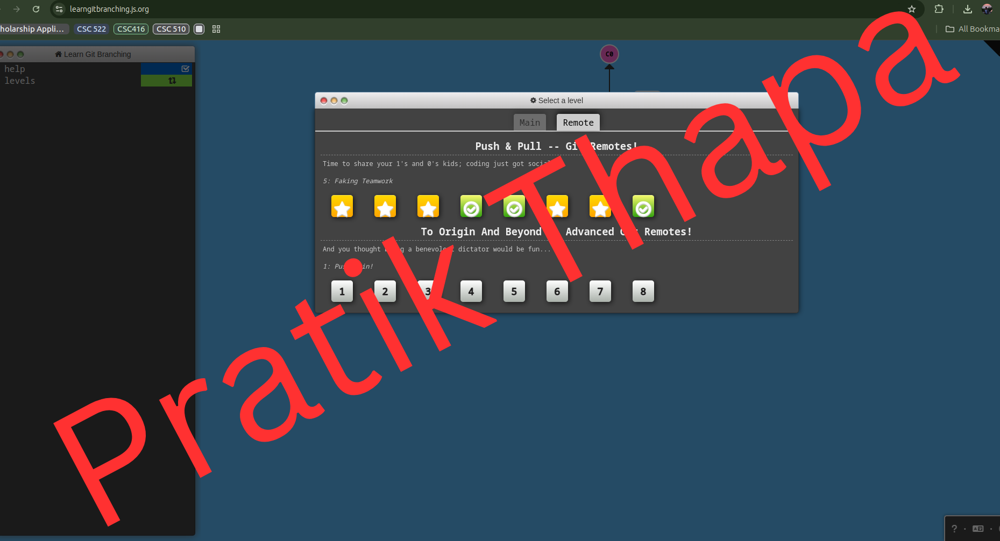
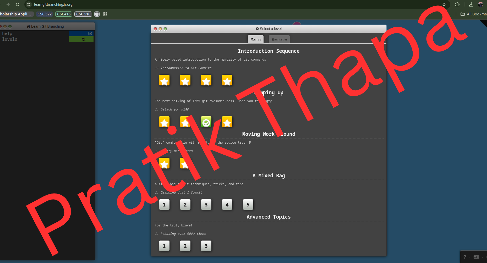
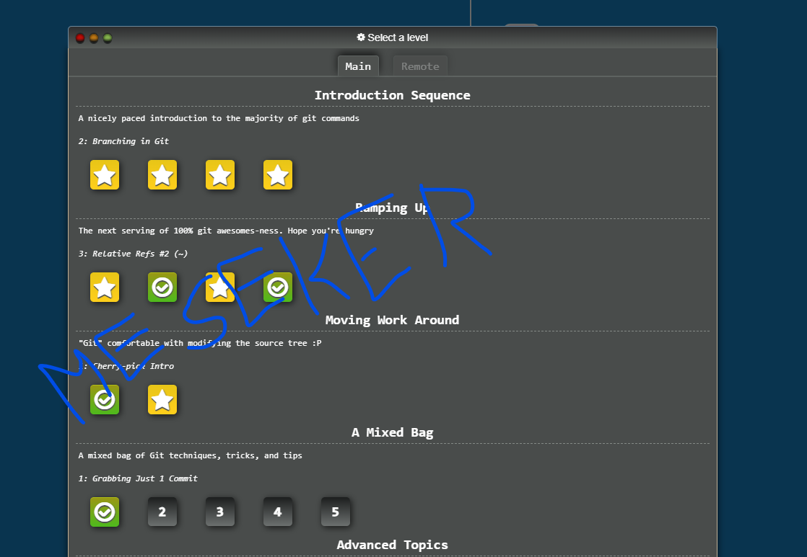
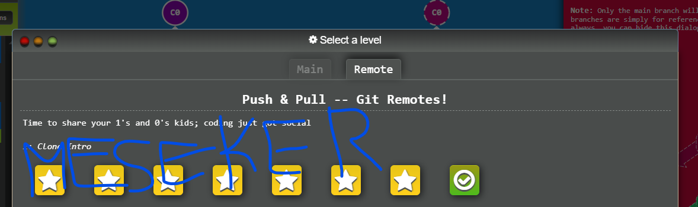

## 📝 Introduction
This is a project developed by Team 17, consisting of Pratik Thapa, Meseker Worku, and O'Neal M'Beri. The goal of this project is to showcase the functionality of Git workflows and provide a collaborative platform for learning and development.

## 📸 Image
### Pratik Thapa 
#### Image 1

#### Image 2

### Meseker Worku
#### Image1

#### Image2

## 💻 Code Example

## Task Lists

### Pratik Thapa
- [X] Task 1: Complete Git Tutorial
- [X] Task 2: Add Screenshots to README.md
- [ ] Task 3: Modify .html File
- [ ] Task 4: Merge latest changes
- [ ] Task 5: Review pull requests

# O'Neal M'Beri
- [ ] Task 1: Complete Git Tutorial
- [ ] Task 2: Add Screenshots to README.md
- [ ] Task 3: Modify .html File
- [ ] Task 4: Merge latest changes
- [ ] Task 5: Review pull requests

# Meseker Worku Kebede
- [ ] Task 1: Complete Git Tutorial
- [ ] Task 2: Add Screenshots to README.md
- [ ] Task 3: Modify .html File
- [ ] Task 4: Merge latest changes
- [ ] Task 5: Review pull requests
